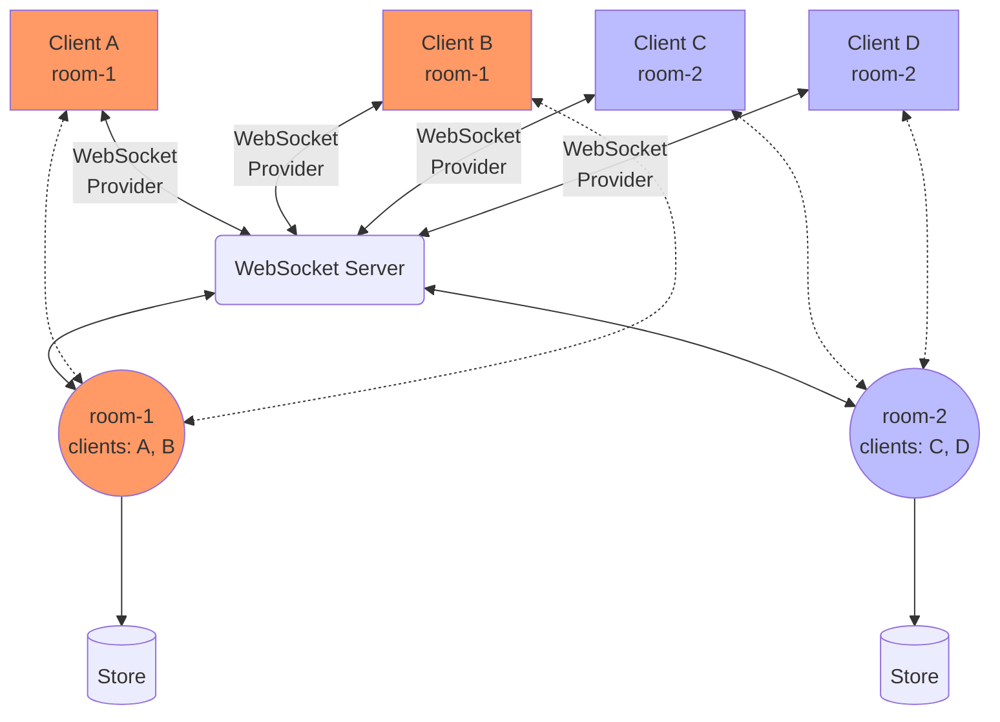

# Pycrdt-websocket

Pycrdt-websocket 是一个用于 pycrdt 的异步 WebSocket 连接器。

[](https://github.com/jupyter-server/pycrdt-websocket/actions)
[](https://github.com/psf/black)

---

**文档**: <a href="https://hellowac.github.io/pycrdt-websocket-zh-cn" target="_blank">https://jupyter-server.github.io/pycrdt-websocket</a>

**源代码**: <a href="https://github.com/hellowac/pycrdt-websocket-zh-cn" target="_blank">https://github.com/jupyter-server/pycrdt-websocket</a>

---

Pycrdt-websocket 是一个用于构建 WebSocket 服务器和客户端的 Python 库，旨在连接和同步共享文档。
它可以用来创建协作式的 Web 应用程序。

以下图示展示了一个典型的架构。目标是让多个客户端共享一个文档。

每个客户端都有一个 `Doc` 实例，表示其视图中的文档。共享文档也在服务器端的 [room](./reference/Room.md) 中存在。从概念上讲，room 是客户端共同协作文档的地方。客户端连接的 WebSocket 通过端点路径指向相应的 room。在下面的示例中，客户端 A 和 B 连接到路径为 `room-1` 的 WebSocket，因此两者都进入了一个名为 `room-1` 的房间。所有 `Doc` 同步的逻辑由 [WebsocketProvider](./reference/WebSocket_provider.md) 处理。

每次更新共享文档时，可以使用 [store](./reference/Store.md) 将其持久化到磁盘，该存储可以是文件或数据库。




## 文档

针对中文版

```shell
# 调试
mkdocs serve -f mkdocs.cn.yml serve

# 部署到github pages
mkdocs build -f mkdocs.cn.yml gh-deploy
```